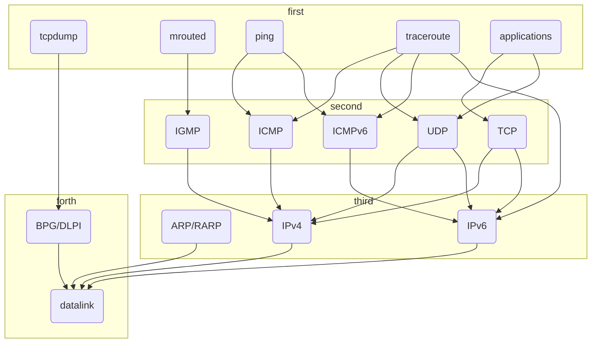
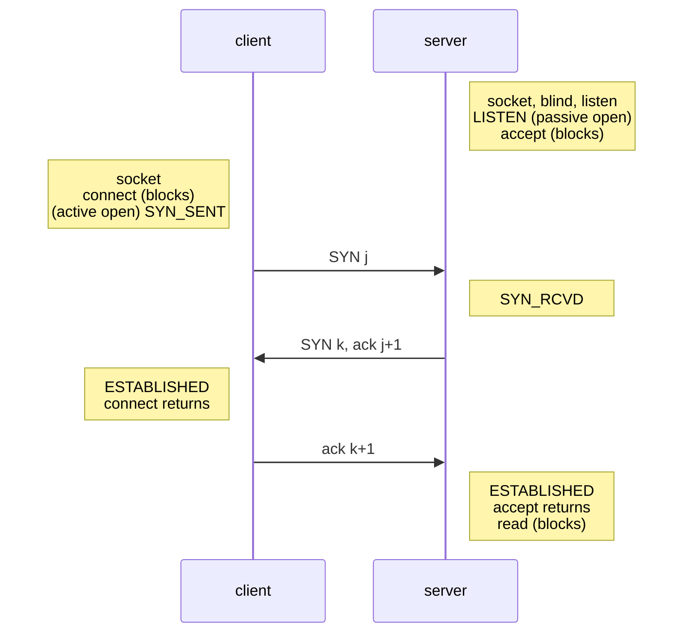
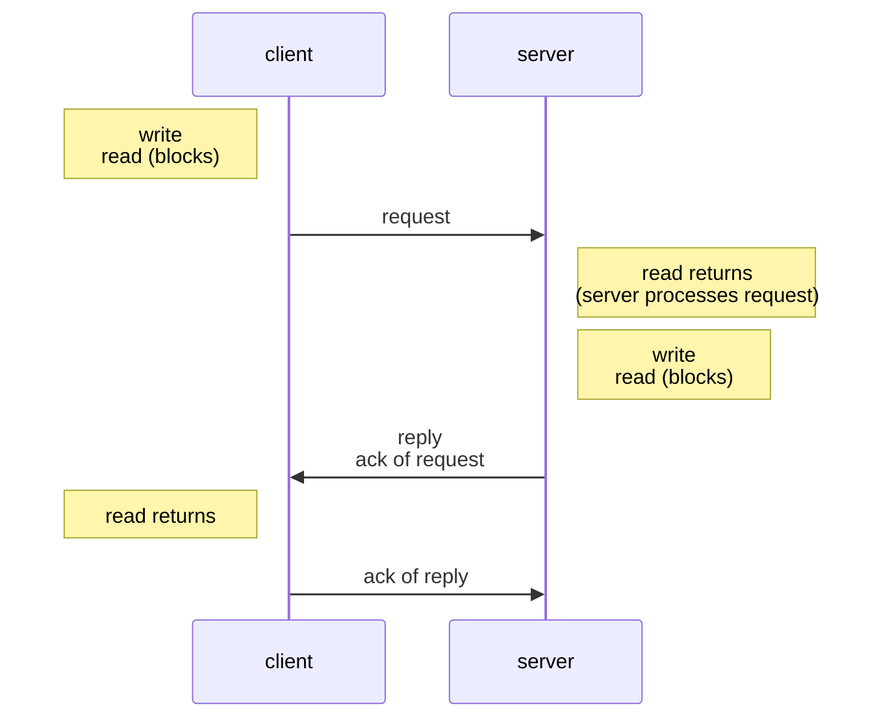
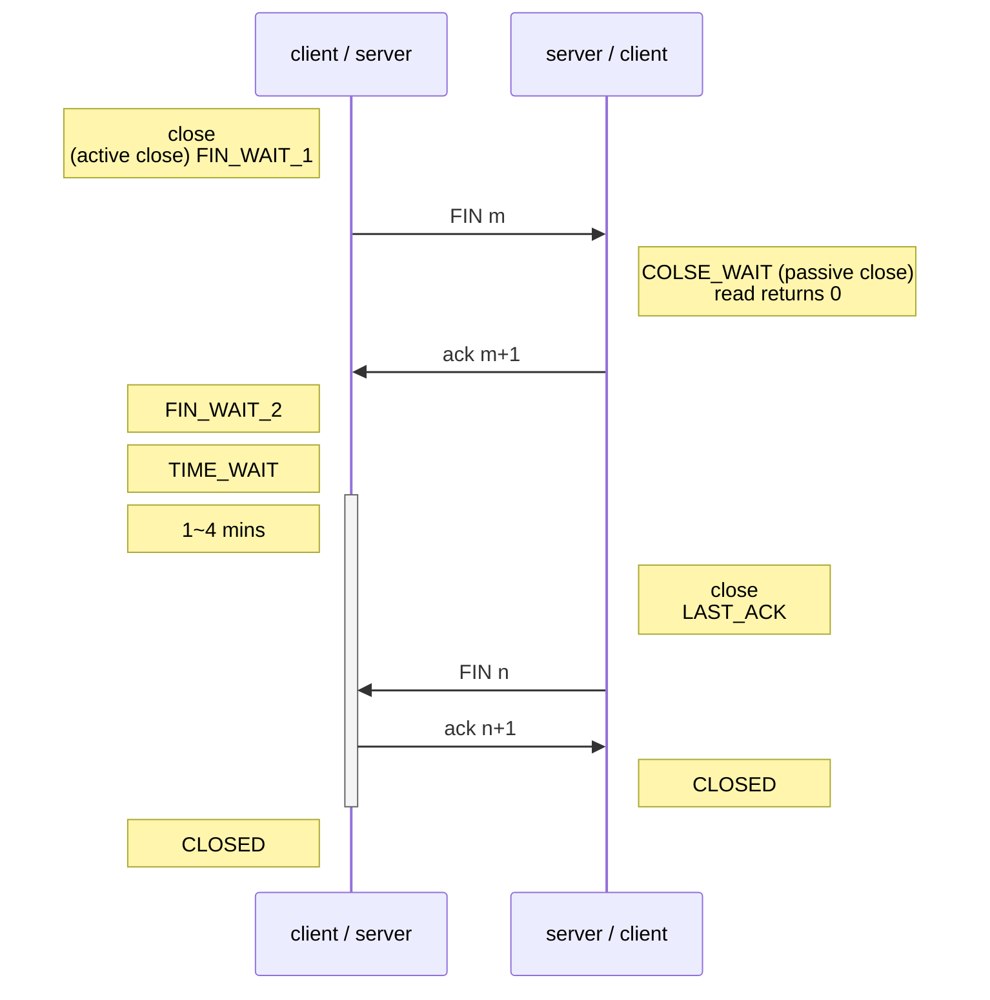

# Transport Layer: TCP and UDP

## Overview of TCP/IP Protocols

## Comparing TCP and UDP

|                                   | TCP                          | UDP                     |
| ---------------------------------:|:----------------------------:|:-----------------------:|
| binding Between client and server | Yes connection-oriented | No connection-less |
| data                              | byte-stream                  | record                  |
| reliability                       | Yes ack, time-out, retx | No                      |
| sequencing                        | Yes                          | No                      |
| flow control                      | Yes window-based        | No                      |
| full-duplex                       | Yes                          | Yes                     |

## TCP Connection

### Establishment

#### Three-way handshake

### Data Transfer

### Termination

#### Four-way handshake

`TIME_WAIT` to allow old duplicate segment to expire for reliable termination. (the end performing active close might have to retx the final ACK)

### TCP State Transition Diagram

## Allocation of Port Numbers

- IANA (Internet Assigned Numbers Authority)
  - 1 ~ 1023
    - IANA well-known ports
  - 1024 ~ 49151
    - IANA registered ports
  - 49152 ~ 65535
    - IANA dynamic or private ports
- BSD
  - 1 ~ 1023
    - BSD reserved ports
  - 1024 ~ 50000
    - BSD **ephemeral** (short period of time) ports 
  - 50001 ~ 65535
    - BSD nonprivileged servers
- Solaris
  - 513 ~ 1023
    - Solaris reserved ports
  - 32768 ~ 65535
    - Solaris ephemeral ports
