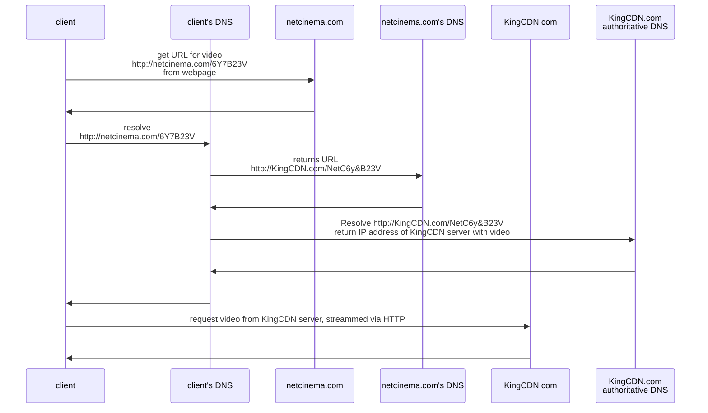
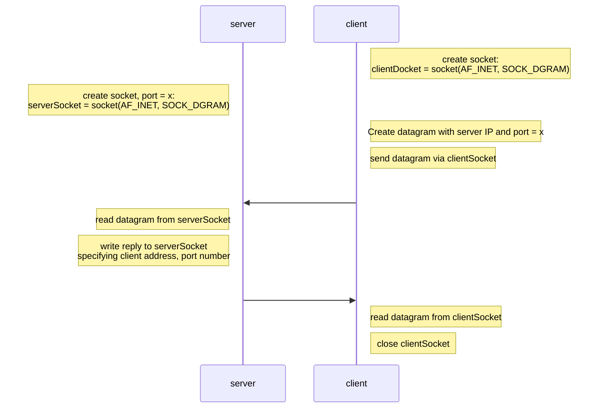
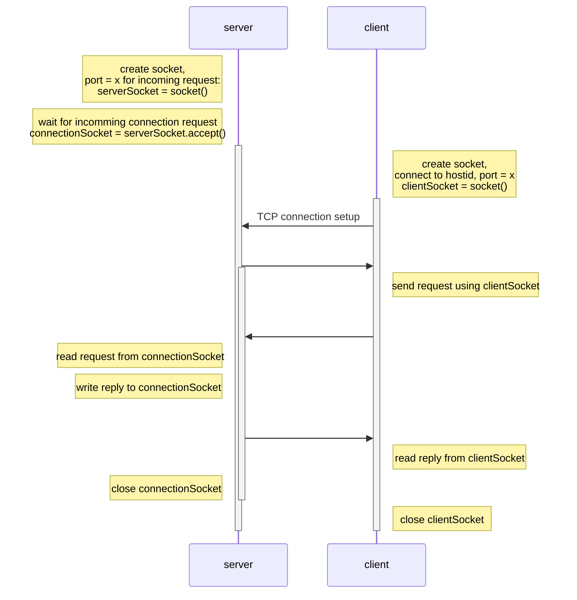

# Chapter 2 Application Layer

## Architectures

- ### client to server

  - always-on host
  - data center
  - server has permanent IP address
  - clients don't communicate directly with each other

- ### Peer to Peer (P2P)

  - not always-on host
  - arbitrary end systems directly communicate
  - peers request services from other peers
  - decentralization

## Sockets

- Process sends and receives data from its socket.
- sockets just like doors
- In [[Chapter 1 Introduction#Internet protocol stack|network stack]], `transport` layer and below are controlled by OS, and socket lies between `application` and `transport`.

## Address

to receive messages, process must have **identifier**.

identifier includes **IP** and **port number**.

## What transport services does an app need?

- data integrity
- timing
- throughput
- security

## Internet transport protocols services

- ## TCP

  - reliable
  - flow control
    - sender won't overwhelm receiver
  - congestion control
    - throttle sender when network overloaded
  - connection oriented
    - setup required between server and client
  - Good for file transfer, which need to ensnare file correctness.

- ### UDP

  - not reliable
  - Good for video conference calls, since small part of data lost doesn't effect the service.

- ### SSL

  - Provides encrypted TCP connection, data integrity, end-point authentication.
  - An application layer.

## HTTP

- use TCP, default port is 80.
- stateless
  - server maintains no information about past client requests

### connections

- #### none-persistent HTTP

  - send one object per one TCP connection

  - downloading multiple objects require multiple TCP connections

  - ```mermaid
    sequenceDiagram
    participant c as client
    participant s as server
    c->>s: initiates TCP connection
    s->>c: accepts connection, notifying client
    c->>s: sends HTTP request message into TCP connection socket
    s->>c: forms response and sends message into its socket
    note left of s: TCP conection closed
    note right of c: receives messages
    note over s, c: repeat for each object
    ```

  - OS overhead for each TCP connection

  - browsers often parallel TCP connections to fetch objects

- #### persistent HTTP

  - multiple objects can transfer between client and server with one TCP connection.
  - server leaves connection open after sending response.
  - subsequent HTTP messages send over same connections.

### HTTP message

- #### request

  - Human readable format
  - Method
    - GET
    - POST
    - HEAD
    - PUT (HTTP 1.1)
    - DELETE (HTTP 1.1)

- #### response

  - status code

## Cookies

- keep and manage on user's browser

- can be use for: authorization, shopping carts, recommendations, etc.

- ```mermaid
  sequenceDiagram
  participant c as client
  participant s as server(amazon)
  note left of c: ebay 8734
  c->>s: usual HTTP request
  note right of s: creates ID 1678<br/>Save to database
  s->>c: usual HTTP respond<br/>cookie: 1678
  note left of c: ebay 8734<br/>amazon 1678
  c->>s: usual HTTP request<br/>cookie: 1678
  s->>c: usual HTTP respond
  ```

## Web Cache (proxy server)

satisfy client request without involving origin server.

- reduce response time for client request
- reduce traffic
- enables poor server to effectively deliver contents
- conditional `GET`
  - don't send objects if cache has up to date version

## Email

### User agent

- mail reader
- composing, editing, reading email messages

### Mail server

- **mailbox** contents incoming messages for user
- **message queue** for outgoing mail messages
- **SMTP protocol** between mail server to send mail messages

### SMTP

- uses TCP port 25
- phases of transfer
  - handshaking
  - messages
  - closure
- command/response act like HTTP
- messages must be in 7-bit ASCII
  - other language must encode before sending

### Mail access protocols

Different from SMTP, mail access protocols are for client fetching mails from server.

- POP
  - only authorization and download
- IMAP
  - more features including modify messages on server.
- HTTP
  - Gmail

## DNS

Map between IP address and domain name.

- distributed database
  - if client wants IP for `www.amazon.com`
    - client queries `root DNS server` to find `com DNS server`
    - client queries `com DNS server` to get `amazon.com DNS server`
    - client queries `amazon.com DNS server` to get IP address of `www.amazon.com`
- application-layer protocal
  - hosts, name servers communicate to **resolve** names.
- host aliasing
- load distribution
  - many IP addresses correspond to one domain name

### Root Name Server

- contract by local name server if it cannot resolve the name
  - gets mapping
  - returns a list of TLD server to local name server

### Top-Level Domain Servers (TLD)

- responsible for com, org, net, edu...
- top-level country domains: uk, ca, jp..

### Local DNS Name Server

- does not strictly belong to hierarchy
- each ISP, university, company has one
- when makes DNS query, query is usually sent to its local DNS server
  - local cache
  - acts as proxy, forwards query to other DNS server if it is not cached

### Caching

- cashing entries timeout after some time
- TLD servers typically cached in local name servers
- may be out of date

### Records

- DNS records save in resource records format (RR)
- RR format: (`name`, `value`, `type`, `ttl`)
  - type = A
    - `name` is hostname
    - `value` is IP address
  - type = NS
    - DNS server
    - `name` is domain
    - `value` is hostname
    - since it save hostname, you might need to query twice
      - first query get hostname, second query get IP address
  - type = CNAME
    - `name` is alias for some real name
    - `value` is real name
  - type = MX
    - `value` is name of mail sever associated with name

### Protocol

query and reply message with same format

- message header
  - identification
    - 16 bit for identify query, reply to query use same id
  - flags
    - query or reply
    - recursion desired
    - recursion available
    - reply is authoritative
- questions
- answers
  - RR in response to query
- authority
- additional info

### Attacking DNS

- DDoS
- redriect attacks
  - man-in-middle intercept queries
  - send fake relies to DNS server, which caches
- exploit DNS for DDoS
  - send queries with spoofed source address

## P2P

- no always-on server
- any end systems directly communicate
- peers are intermittently connected and may change IP address

### File Distribution: BitTorrent

- file divided into 256kb chunks
- peers in torrent send and receive file chunks

#### Structure

- tracker: tracks peers participating in torrent
- torrent: group of peers exchanging chunks of a file

#### Flow

- peer joining torret
  - has no chunks, but will get them over time from other peers
  - registers with tracker to get list of peers, connects to subset of peers
- while downloading, peer uploads chunks to other peers
- peer may change peers with whom it exchanges chunks
- churn: peers may come and go
- once peer has entire file, it may leave or remain in torrent

#### Requesting Chunks

- different peers have different subsets of file chunks
- peer asks other peers for list of chunks that they have periodically
- requests missing chunks from peer, rarest first.

#### Sending Chunks: tit-for-tat

- peer sends chunks to those 4 peers currently sending him chunks at highest rate
  - other peers are choked by him (don't receive chunks from him)
  - re-evaluate top 4 every 10 secs
- every 30 secs: randomly select 

## Video Streaming and CDN

- video traffic is major consumer of Internet bandwidth
- single video server won't work
- different users have different capabilities
- solution: distributed, application-level infrastructure

### Video

- video: sequence of images displayed at constant rate
- image: array of pixels

#### Coding

use redundancy **within** and **between** images to decrease number of bits used to encode image

- spatial coding
  - instead of sending `n` same color, send only two values: `color` and `n`.
- temporal coding
  - send only differences from frame `i` and `i+1`.

#### Bit Rate

CBR (Constant Bit Rate):

- fixed video encoding rate

VBR (Variable Bit Rate):

- change as amount of coding changes

### DASH

Dynamic, Adaptive Streaming over HTTP

server:

- divides video files into multiple chunks
- each chunk stored, encoded at different rates
- **manifest file** provides URLs for different chunks

client:

- periodically measures server-to-client bandwidth
- consulting manifest, requests one chunk at a time
  - chooses maximum coding rate sustainable
  - can choose different coding rate at different points in time

#### Intelligence at Client

client determines...

- **when** to request chunk
- **what** encoding rate to request
- **where** to request chunk

### CDN

Content Distribution Networks

How to stream content to hundreds of thousands of simultaneous users?

1. one single, large server

   - single point of failure

   - point of network congestion

   - long path to distant clients

   - multiple copies of video sent over outgoing link

   - this solution **doesn't scale**

2. store/serve multiple copies of video at multiple geographically distributed sites (CDN)

   - enter deep
     - push CDN servers deep into many access networks
     - close to users
   - bring home
     - smaller number of larger clusters in PoPs near access networks

- CDN stores copies of content at CDN nodes
- client requests content form CDN
  - directed to nearby copy, retrieves content
  - may choose different copy if network path congested

#### Over The Top (OTT)

coping with congested Internet

- from each CDN node to retrieve content?
- viewer behavior in presence of congestion?
- what content to place in which CDN node?

#### Example

Bob client requests video `http://netcinema.com/6Y7B23V`.

Video stored in CDN at `http://KingCDN.com/NetC6y&B23V`.



## Socket Programming

socket: door between application process and end-end-transport protocol.

Two socket types for two transport services:

- UDP: unreliable datagram
- TCP: reliable, byte stream-oriented

### with UDP

no "connection" between client and server

- not handshaking before sending data
- sender **explicitly** attaches **IP destination address** and **port number** to each packet
- receiver extracts sender IP address and port number from received packet
- transmitted data may be lost or received out-of-order

application viewpoint:

- UDP provides unreliable transfer of groups of bytes (datagrams) between client and server

#### Interaction



### with TCP

client must contract server

- **server process** must **first** be running
- server must have created socket that welcomes client's contact

client contracts server by:

- creating TCP socket, specifying IP address, port number of server process
- when client creates socket, client TCP establishes connection to server TCP
- when contracted by client, server TCP creates **new socket** for server process to communicate with that particular client
  - allows server to talk with multiple clients
  - **source port numbers** used to distinguish clients

application viewpoint:

- TCP provides reliable, in-order byte-stream transfer (pipe) between client and server

#### Interaction




