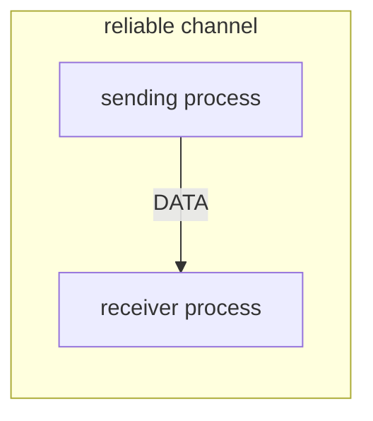
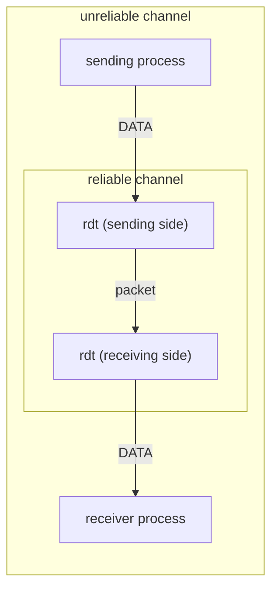
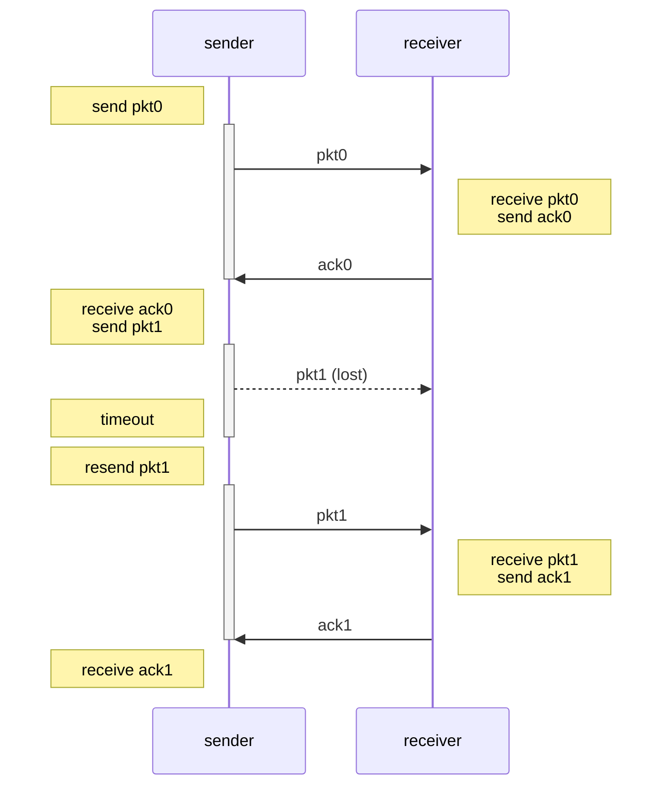
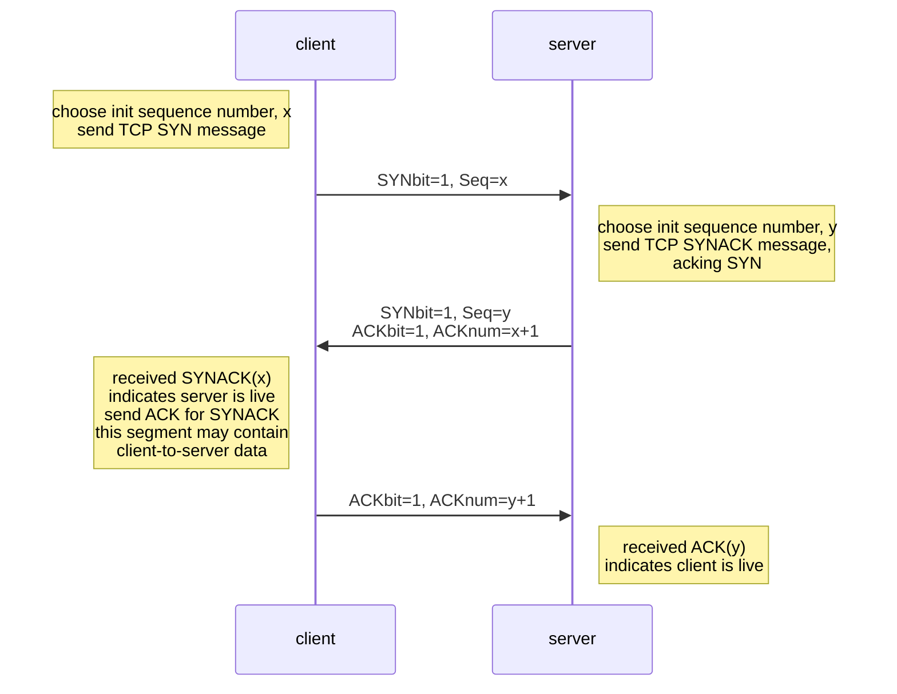
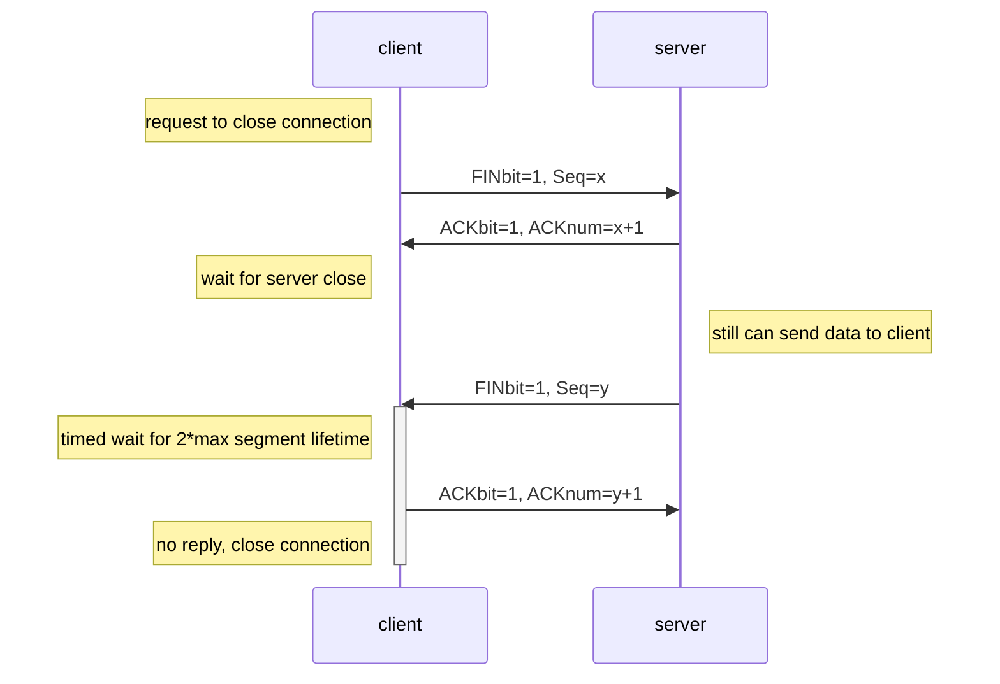

# Chapter 3 Transport Layer

## Transport services and protocols
- provide **logical communication** between app processes running on different hosts
- transport protocols run in end systems
  - send side
    - breaks app messages in segments, passes to network layer
  - receive side
    - reassembles segments into messages, passes to app layer
- more than one transport protocol available to apps
  - Internet: TCP and UDP

### Transport vs Network Layer
- network layer
  - logical communication between **hosts**
- transport layer
  - logical communication between **processes**
    - relies on network layer services

### Internet Transport-Layer Protocols
- TCP
  - congestion control
  - flow control
  - connection setup
- UDP
- not available:
  - delay guarantees
  - bandwidth guarantees

## Multiplexing / Demultiplexing
- multiplexing at sender
  - handle data from **multiple sockets**
  - add **transport header** (later used for demultiplexing)
- demultiplexing at receiver
  - use **header info** to deliver received segments to **correct socket**

### How demultiplexing works?
- host receives IP datagrams
  - each **datagram** has source IP address, destination IP address
  - each **datagram** carries one transport-layer **segment**
  - each **segment** has source, destination port number
- host uses **IP address & port numbers** to direct segment to appropriate socket

### Connectionless Demultiplexing
when host receives UDP segment:
- checks **destination port number in segment**
- directs UDP segment to socket with that port number

IP datagrams with **same destination port number**, but different source IP addresses or source port will be directed to **same socket at destination**.

### Connection-Oriented Demultiplexing
- TCP socket identified by 4-tuple
  - source IP address
  - source port number
  - destination IP address
  - destination port number
- receiver **uses all four values** to **direct segment to appropriate socket**
- server host may support many simultaneous TCP sockets
  - each socket **identified by its own 4 tuple**
- web servers have different sockets for each connecting client
  - non-persistent HTTP will have different socket for each request 

## Connectionless Transport: UDP
User Datagram Protocol

- "no frills", "bare bones" Internet transport protocol
- "best effort" service, UDP segments may be:
  - lost
  - delivered out-of-order to app
- **connectionless**:
  - **no handshaking** between UDP sender, receiver
  - each UDP segment **handled independently** of others
- usage:
  - streaming multimedia apps (loss tolerant, rate sensitive)
  - **DNS**
  - SNMP
- reliable transfer over UDP
  - add reliability **at application layer**
  - application-specific error recovery

### Segment Header
header including these:
- source port number
- destination port number
- length
  - in bytes of UDP segment, including header
- checksum

and then application data.

#### Checksum
detect errors in transmitted segment

- sender
  - treat **segment contents**, including **header fields**, as sequence of 16-bit integers.
  - addition (one's complement sum) of segment contents
    - When adding numbers, a carryout from the most significant bit needs to be added to the result.
  - sender put checksum value into UDP checksum field
- receiver
  - compute checksum of received segment
  - check if computed checksum equals checksum field value:
    - NO: error detected
    - YES: no error detected

## Principles of Reliable Data Transfer
- important in application, transport, link layers
- characteristics of unreliable channel will determine complexity of reliable data transfer protocol (rdt)

## Reliable Data Transfer (rdt)
Ideal condition:

is actually like this:

- incrementally develop sender, receiver sides of rdt protocol
- consider only unidirectional (one way) data transfer
  - control info will flow on both directions!
- use finite state machines (FSM) to specify sender, receiver

### `rdt1.0`
reliable transfer over a reliable channel

- underlying channel perfectly reliable
- separate FSMs for sender, receiver:
  - sender sends data into underlying channel
  - receiver reads data form underlying channel

### `rdt2.0`
channel with bit errors

- underlying channel may flip bits in packet
  - use **checksum** to detect bit errors
- how to recover from errors?
  - **acknowledgements (ACKs)**
    - receiver explicitly tells sender that packet received OK
  - **negative acknowledgements (NAKs)**
    - receiver explicitly tells sender that packet had errors
  - sender retransmits packet on receipt of NAK

Beyond `rdt1.0`:
- error detection
- feedback
  - control messages (ACK, NAK) from receiver to sender

Fatal flaw:
If ACK/NAK corrupted, sender doesn't know what happened at receiver.

- cannot just retransmit, may **duplicate**
- sender adds **sequence number** to each packet
- receiver discards duplicate packet

### `rdt2.1`
stop and wait

- sender sends one packet, then waits for receiver response.

sender:
- add sequence number to packet
- two sequence number is enough (0, 1)
- must check if received ACK/NAK corrupted
- twice as many states
  - state must remember whether expected packet should have 0 or 1

receiver:
- must check if received packet is duplicate
- receiver cannot know if its last ACK/NAK received OK at sender

### `rdt2.2`
`rdt2.1` without NAK

- instead of NAK, receiver sends ACK for **last packet received that OK**
  - **include sequence number of packet** being ACKed
- if sender **received duplicate ACK**, it will result in same action as NAK: **retransmit current packet**

### `rdt3.0`
underlying channel may lose packets

sender **waits reasonable amount of time** for ACK
- retransmits if no ACK received in this time
  - If packet just delay not lost, retransmission will be duplicate, use sequence number to handle this.
- requires countdown timer

`rdt3.0` is correct, but performance sucks.
- If RTT = 30 msec, 1KB packet every 30 msec:
	33KB/sec throughput over 1 Gbps link.

network protocol limits use of physical resources.

### Pipelined Protocol
Sender allows **multiple, in-flight, yet-to-be-acknowledged packets**.
- range of sequence numbers must be **increased**
- **buffering** at sender or receiver

two generic forms of pipelined protocols:
- go-Back-N
- selective repeated

#### Go-Back-N
- sender can have up to N unacked packets in pipeline
- receiver only sends **cumulative ack**
  - doesn't ack packet if there is a gap for sequence number
  - only send ACK for **last expected packet number**
- sender has **timer** for **oldest unacked packet**
  - when timer expires, **retransmit all unacked packets**
- **ACK-only**
  - always send ACK for correctly-received packet with highest in-order sequence number
  - may generate duplicate ACKs
  - **discard received out-of-order packet** (**no receiver buffering**)
	  - since sender will resend all unacked packet

#### Selective Repeated
- sender can have up to N unacked packet in pipeline
- receiver sends **individual ack** for each packet
- sender maintains **timer** for **each unacked packet**
  - when timer expires, retransmit only that unacked packet

sender:
- if next available sequence number in window, send it
- if packet n timeout, resend packet n
	- received ack n
	- mark packet n as received
	- advance window base to next unacked sequence number

receiver:
- receive packet n in window
	- send ACK n
	- out-of-order: store to buffer
	- in-order: advance window to next not-yet-received packet
- receive packet n before window
	- send ACK n
- otherwise just ignore

## Connection-Oriented Transport: TCP
- point-to-point
  - one sender, one receiver
- **reliable**, in-order byte stream
  - no "message boundaries"
- **pipelined**
  - TCP congestion and flow control set window size
- full duplex data
  - **bi-directional** data flow in same connection
  - MMS: maximum segment size
- **connection-oriented**
  - handshaking initializes sender, receiver state before data exchange
- **flow controlled**
  - sender won't overwhelm receiver

### Segment Structure
- source port
- destination port
- sequence number (counting by bytes of data)
- acknowledgement number (counting by bytes of data)
- URG
  - urgent data (generally not used)
- **ACK**
  - ACK number
- PSH
  - push data now (generally not used)
- RST, SYN, FIN
  - connection establish (setup, teardown commands)
- receive window
  - number of bytes receiver willing to accept
- checksum
- Urg data pointer
- options

and than application data

#### Sequence Number, ACKs
sequence numbers: byte stream "number" of first byte in segment's data

acknowledgements:
- sequence number of next byte expected from other side
- **cumulative ACK**
	- TCP doesn't use Go-Back-N purely. It's more like the remix of two.
	When TCP receives out-of-order packets, it will store in buffer (Selective Repeated).
	Meanwhile sending ACK for correctly-received packet with highest in-order sequence number (Go-Back-N). (Typically, but actually TCP spec doesn't say.)

#### Timeout
How to set TCP timeout value?

- must be longer than RTT
- too short may produce unnecessary retransmissions
- too long leads to slow reaction to segment loss

How to estimate RTT?
- `SamlpeRTT`
  - measure time form segment transmission until ACK receipt.
    - ignore retransmissions
  - average several recent measures, not just current one.
- $\text{EstimatedRTT} = (1 - \alpha) * \text{EstimatedRTT} + \alpha * \text{SampleRTT}$
  - $\alpha = 0.125$ typically
- $\text{DevRTT} = (1-\beta)*\text{DevRTT}+\beta*\lvert \text{SampleRTT} - \text{EstimatedRTT}\rvert$
  - $\beta = 0.25$ typically
  - safe margin
- $\text{TimeoutInterval} = \text{EstimatedRTT} + 4*\text{DevRTT}$

### Reliable Data Transfer
TCP creates `rdt` service on top of `IP`'s unreliable service
- pipelined segments
- cumulative acks
- **single** retransmission timer

retransmissions triggered by:
- timeout events
- duplicate acks

#### TCP Sender Events
- data received from app
	- create segment with sequence number
		- sequence number is byte-stream number of first data byte in segment
    - start timer if not already running
		- for oldest unacked segment
		- `TimeOutInterval`
- timeout
	- retransmit segment that cause timeout
	- restart timer
- ack received
	- if ack acknowledges previously unacked segments
		- start timer if there are still unacked segments

#### TCP Receive Event
- receive in-order segment, every segment is acked
  - Wait up to 500ms for next segment.
  - If no segment, sent ACK
- receive in-order segment, one other segment has ACK pending
  - acking **both** in-order segments **immediately**
- receive **out of order** segment, gap detected
  - send duplicate ACK
- receive of segment that partially or completely fills gap
  - send ACK, provided that segment starts at lower end of gap

#### TCP Fast Retransmit
time-out period often relatively long

detect lost segments via duplicate ACKs
- sender often sends many segments back-to-back
- if segment is lost, there will likely duplicate ACKs.

TCP fast retransmit:
- If sender receives **3 ACKs for same data**, resend unacked segment with smallest sequence number.
  - **likely** that unacked segment lost, so **don't wait** for timeout.

### Flow Control
receiver controls sender, so sender won't **overflow** receiver's buffer by transmitting too much, too fast.

- receiver "advertises" **free buffer space** by including **`rwnd`** value in TCP header of **receiver-to-sender segments**
  - `rwnd`: free buffer space
  - `RcvBuffer` size set via socket options (typical default is 4096 bytes)
  - many operating systems auto adjust `RcvBuffer`
- **sender** limits amount of unacked (in-flight) data to receiver's `rwnd` value
- guarantees receive buffer will not overflow

### Connection Management
before exchanging data, sender/receiver "**handshake**"
- agree to **establish connection**
- agree on **connection parameters**

#### TCP 3-way handshake

#### Closing a Connection
- client, server each close their side of connection
  - send TCP segment with FIN bit = 1
- respond to received FIN with ACK
  - on receiving FIN, ACK can be combined with own FIN
- simultaneous FIN exchanges can be handled

## Principles of Congestion Control
congestion:
- too many sources sending too much data too fast for network to handle
- different from flow control
- lead to...
  - lost packets (buffer overflow at routers)
  - long delays (queueing in router buffers)

## TCP Congestion Control
MSS: maximum segment size
RTT: round-trip time

sender increases transmission rate (window size), probing for usable bandwidth, **until loss occurs**
- **additive increase**
  - increase `cwnd` by 1 MSS every RTT until loss detected
- **multiplicative decrease**
  - cut `cwnd` in **half** after loss

### Details
- sender limits transmission:
    $$
  \text{LastByteSent}-\text{LastByteAcked}\leq \text{cwnd}
  $$
- `cwnd` is dynamic, function of perceived network congestion
- TCP sending rate:
    $$
  \text{rate}=\frac{\text{cwnd}}{\text{RTT}}\ \text{bytes}/\text{sec}
  $$
  send `cwnd` bytes, wait RTT for ACKs, then send more bytes

### Slow Start
when connection begins, increase rate **exponentially** until first loss event

- initially `cwnd` = 1 MSS
- double `cwnd` every RTT
- done by incrementing `cwnd` for every ACK received

initial rate is slow but ramps up exponentially fast

### Detecting, Reacting to Loss
- loss indicated by **timeout**
  - `cwnd` set to 1 MSS
  - window then grows exponentially to threshold, then grows linearly
- loss indicated by 3 duplicate ACKs TCP RENO
  - indicate that network capable of delivering some segment
  - `cwnd` is cut in half window then grows linearly
- TCP Tahoe always set `cwnd` to 1 (timeout or 3 duplicate acks)

### Switching From Slow Start to CA
When should the exponential increase switch to linear?
when `cwnd` gets to **$\frac{1}{2}$ of its value before timeout**
Set a variable `ssthresh`

- on loss event, `ssthresh` is set to $\frac{1}{2}$ of `cwnd` just before loss event

### Throughput
W: window size (measure in bytes) where loss occurs

- average window size (number of in-flight bytes) is $\frac{3}{4}\ W$
- average thruput is $\frac{3}{4}\ W$ per RTT

#### Explicit Congestion Notification
network-assisted congestion control
- 2 bits in **IP header** (ToS field) marked by network router to indicate congestion
- congestion indication carried to **receiver**, set ECE bit on **receiver-to-sender ACK segment** to notify sender of congestion
