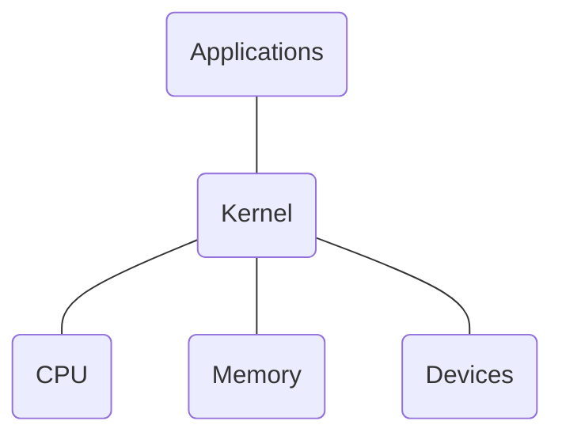

# Install FreeBSD

## FreeBSD Version

- Three parallel development branches
  - RELEASE
    - suitable for production use
  - STABLE
    - tested new features and bug fixes
  - CURRENT
    - working...
- Support Model

  - stable branch of major version is supported for 5 years
  - each point release is only support for 3 months after next point release

## FreeBSD Installation

### `bsdinstall`

An easy to use, **text-based** installation program.

- select keymap
- setting hostname
- select components to install
- choose partition methods
  - Auto ZFS/UFS
  - Shell (`gpart`, `fdisk`, `bsdlabel`)
- fetching -> checksum verification -> extraction
- root password
- network interfaces
  - IPv4 / IPv6
  - DHCP
  - DNS
- time zone
- services
- add users

### Post-installation

- Update to latest patch
  - `sudo freebsd-update fetch install`
- check system patch version
  - `uname -r`

## Partitioning scheme

- Master Boot Record (MBR)
  - 4 primary partitions
  - 1 extended partition
  - multiple logical partitions
- GUID Partition Table (GPT)
  - 128 partitions

# Installing Applications in FreeBSD

## `root`

- In Unix-like system, `root` is the conventional name of the user who has all rights or permissions in all modes  (single- or multi-user).
- It is dangerous to execute all commands as root directly.
- Sometimes you still need to be root to do something
  - install software
  - manage system settings
  - create/modify/delete users
- use command `su` and type root's password
  - only user in `wheel` group can use `su`
- use `whoami` to see which credit is using
  - `who am i` can see which user I am logging in

## Install Software

- Pre-built binary package
  - `pkg`
- build from source code
  - `ports`
  - download source code

## `sudo`

- run commands with other user's permission

- By default, FreeBSD doesn't come with `sudo`

  - `pkg install sudo` to install

- Change `sudo` settings via `visudo`

  - Change editor to `vim` by `setenv EDITOR vim`

  - add user under `User priviledge specification`

    ```
    root ALL=(ALL) ALL
    zolark173 ALL=(ALL) ALL
    ```

- no need to re-type within 5 minutes by default

  - change to no password

    ```
    zolark173 ALL=(ALL) NOPASSWD:ALL
    ```

## `pkg`

- pre-built ports
- fetch packages from a repository
  - automatically update the database
- need root permission
- don't require any additional compilation
- default settings
- dependency checking
- commands
  - `pkg install <package name>`
  - `pkg upgrade`
  - `pkg delete <package name>`
  - `pkg search <keyword>`
  - `pkg info`
    - show all installed packages
  - `pkg info <package name>`
    - show detailed information
  - `pkg version`
    - show version of installed packages
  - `pkg audit`
    - show security problems of installed apps
      - no matter from port or pkg

## `ports`

- automate the process of compiling an software from source code

- user can tweak the compilation options to optimization

- dependency checking

- obtaining the ports collection

  - `portsnap`
    - fetch and update ports tree
    - `sudo portsnap fetch extract update`
  - `git`
  - port directory
    - `/usr/ports/<category>/<name>`
  - run `sudo make fetchindex` to fetch index for searching

- find ports

  - traditional way
    - `cd /usr/ports`
    - `make search name=<program name>`
    - `make search key=<string>`
  - `psearch`
    - `psearch <ports name>`

- `make install clean` to install application

  - `make config (/var/db/ports/)`
  - `make fetch (/usr/ports/distfiles/)`
  - `make checksum`
  - `make extract`
  - `make patch`
  - `make configure`
  - `make build`
  - `make` will do above automatically
  - `make install`
  - `make clean`
  - `make distclean`
    - clean downloaded distribution files

- `fetch`

  - ports use `fetch` to download the files

  - `MASTER_SITES` environment variable

  - `/etc/make.conf`

    ```
    MASTER_SITE_BACKUP?= \
    	http://FreeBSD.cs.nctu.edu.tw/distfiles/${DIST_SUBDIR}/
    MASTER_SITE_OVERRIDE?= ${MASTER_SITE_BACKUP}
    ```

- `ports-mgmt/portmaster`

  - a utility for easy upgrading and installing ports

    ``` shell
    cd /usr/ports/ports-mgmt/portmaster
    make install clean
    ```

  - `postmaster <category>/<name>` to install or update a port
  - read `usr/ports/UPDATING` before perform upgrade
  - useful options
    - `-B`
    - `-D`
    - `-a`
    - `-r`
    - `-y`
    - `-H`
    - `-w`

## Deinstall Applications

- `pkg delete`
  - dependency check
    - `-f` to force it without checking dependency
- `make deinstall`
  - run under port's directory
  - or delete the folder anyway

# Shells

Interface to communicate with kernel



## Shell Startup Files

- `sh`
  - `/etc/profile` login shell, system wide
  - `~/.profile` login shell
  - `ENV`
- `csh`
  - `/etc/csh.cshrc` always, system wide
  - `/etc/csh.login` login shell, system wide
  - `~/.cshrc` always
  - `~/.login` login shell
  - `~/.logout` logout shell
  - `/etc/csh.logout` logout shell, system wide
- `tcsh`
  - `~/.tcshrc` login shell
  - `csh`'s files
- `bash`
  - `~/.bash_profile` login shell
  - `~/.bash_login` login shell
  - `~/.profile` login shell
  - `~/.bashrc` login shell
  - `BASH_ENV`

use `source <file name>` to to run and execute commands in the file
